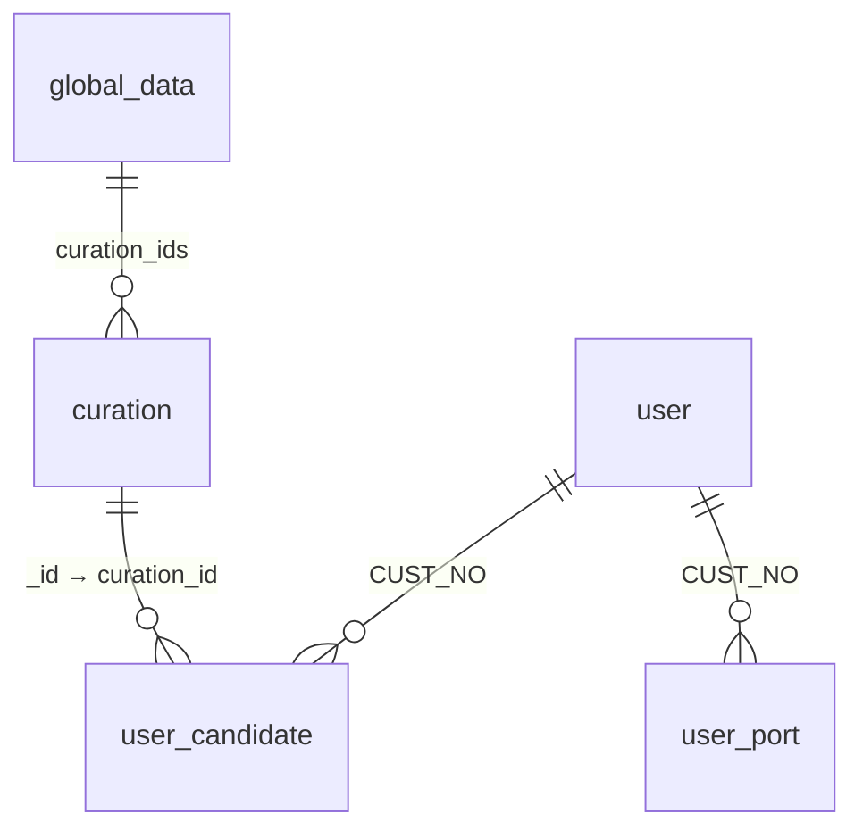

## MongoDB 스키마 (추천 시스템)

### `user`

| column\_name       | type           | constraints | description                                     |
| ------------------ | -------------- | ----------- | ----------------------------------------------- |
| \_id               | ObjectId       | PK          | MongoDB 기본 식별자                                  |
| CUST\_NO           | Number         | Unique      | 고객 번호, 시스템 전역 식별자. `user_candidate.cust_no`와 연결 |
| wlcm\_msg          | String         |             | 개인화 환영 메시지                                      |
| last\_login\_dt    | ISODate / null |             | 마지막 로그인 시각                                      |
| last\_upd\_dt      | ISODate / null |             | 사용자 정보 수정 시각                                    |
| agreement          | Boolean        |             | 서비스 이용 동의 여부                                    |
| user\_vec          | Array<Number>  |             | 사용자 특성 벡터 (클러스터링 ID 등)                          |
| conc               | Array<Object>  |             | 관심사 목록 `{cat_nm: String, prto: Number}`         |
| recent\_stocks     | Array<String>  |             | 최근 본 주식 코드 목록                                   |
| group1\_stocks     | Array<String>  |             | 관심 그룹 1 주식 코드 목록                                |
| onboarding\_stocks | Array<String>  |             | 온보딩 선택 주식 코드 목록                                 |

---

### `user_candidate`

| column\_name   | type                         | constraints         | description          |
| -------------- | ---------------------------- | ------------------- | -------------------- |
| \_id           | ObjectId                     | PK                  | MongoDB 기본 식별자       |
| cust\_no       | Number                       | FK → `user.CUST_NO` | 고객 번호                |
| curation\_list | Object\<curation\_id: score> |                     | 추천 후보 콘텐츠 ID-점수 딕셔너리 |

---

### `curation`

| column\_name       | type              | constraints | description           |
| ------------------ | ----------------- | ----------- | --------------------- |
| \_id               | ObjectId / String | PK          | 콘텐츠 고유 ID             |
| label              | String / null     |             | 콘텐츠 대표 식별자 (예: 주식 코드) |
| title              | String            |             | 콘텐츠 제목                |
| category           | String            |             | 콘텐츠 카테고리              |
| btopic             | String            |             | 대주제                   |
| stopic             | String            |             | 소주제                   |
| thumbnail          | String (URL)      |             | 썸네일 이미지 URL           |
| total\_click\_cnt  | Number            |             | 총 클릭 수                |
| recent\_click\_cnt | Number            |             | 최근 클릭 수               |
| like\_cnt          | Number            |             | 좋아요 수                 |
| dislike\_cnt       | Number            |             | 싫어요 수                 |
| functions          | String / Array    |             | 콘텐츠 기능 태그             |

---

### `user_port`

| column\_name  | type          | constraints         | description    |
| ------------- | ------------- | ------------------- | -------------- |
| \_id          | ObjectId      | PK                  | MongoDB 기본 식별자 |
| cust\_no      | Number        | FK → `user.CUST_NO` | 고객 번호          |
| owned\_stocks | Array<String> |                     | 보유 주식 코드 목록    |

---

### `global_data`

| column\_name  | type          | constraints | description                      |
| ------------- | ------------- | ----------- | -------------------------------- |
| \_id          | String        | PK          | 데이터 종류 식별 키                      |
| description   | String        |             | 데이터 설명                           |
| curation\_ids | Array<String> |             | 추천 콘텐츠 ID 목록 (`curation._id` 참조) |
| last\_updated | ISODate       |             | 마지막 업데이트 시각                      |

---

## 🔗 FK 관계 요약

* `user_candidate.cust_no` → `user.CUST_NO`
* `user_port.cust_no` → `user.CUST_NO`
* `global_data.curation_ids[]` → `curation._id`

---

## 📊 Mermaid ERD

