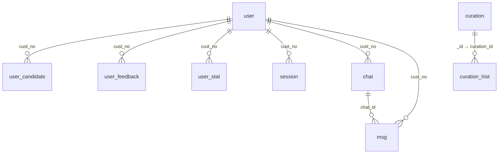

## 📄 테이블 스키마

### `curation`

| column\_name       | type          | constraints | description         |
| ------------------ | ------------- | ----------- | ------------------- |
| \_id               | 시스템키값         | PK          |                     |
| btopic             | string        |             | 대주제                 |
| stopic             | string        |             | 소주제                 |
| label              | string        |             | 라벨                  |
| gic\_code          | string        |             | 예: `UBSTLSA_005930` |
| krw\_currv\_sumamt | int / null    |             | krw 현재시가총액          |
| stk\_name          | string / null |             | 종목명                 |
| title              | string        |             | 제목                  |
| result             | string        |             | 결과값                 |
| thumbnail          | string        |             | 썸네일파일명(CMS? NGINX?) |
| total\_click\_cnt  | int           |             | 총 클릭수               |
| recent\_click\_cnt | int           |             | 최근 클릭수              |
| liked\_users       | cust\_no\[]   |             | 좋아요 표시한 고객 번호 목록    |
| disliked\_users    | cust\_no\[]   |             | 싫어요 표시한 고객 번호 목록    |
| live\_from         | timestamp     |             | 콘텐츠 시작일             |
| entry\_curation    | list\[int]    |             | 진입 큐레이션 ID들         |
| ext\_lm\_yn        | string        |             | 외부 LM 사용 여부         |
| create\_dt         | datetime(utc) |             | 생성 일시               |
| modi\_dt           | datetime(utc) |             | 수정 일시               |

---

### `user_candidate`

| column\_name   | type                              | constraints         | description     |
| -------------- | --------------------------------- | ------------------- | --------------- |
| \_id           | 시스템키값                             | PK                  |                 |
| cust\_no       | string                            | FK → `user.cust_no` | 고객번호            |
| curation\_list | list\[{curation\_id, score\:int}] |                     | 추천 큐레이션 ID 및 점수 |
| create\_dt     | datetime                          |                     | 생성 일시           |
| modi\_dt       | datetime                          |                     | 수정 일시           |

---

### `user`

| column\_name    | type     | constraints | description                     |
| --------------- | -------- | ----------- | ------------------------------- |
| \_id            | 시스템키값    | PK          |                                 |
| cust\_no        | string   |             | 고객번호                            |
| cust\_nm        | string   |             | 고객 이름                           |
| cyber\_id       | string   |             | 사이버 아이디                         |
| last\_login\_dt | datetime |             | 최종 로그인 일시                       |
| user\_vec       | array    |             | 유저 벡터 정보                        |
| concerns        | object   |             | 관심 종목 정보 `{gic_code, stk_name}` |
| create\_dt      | datetime |             | 생성 일시                           |
| modi\_dt        | datetime |             | 수정 일시                           |

---

### `curation_hist`

| column\_name      | type            | constraints         | description |
| ----------------- | --------------- | ------------------- | ----------- |
| \_id              | 시스템키값           | PK                  |             |
| curation\_id      | string          | FK → `curation._id` | 큐레이션 ID     |
| batch\_dt         | string          |                     | 배치 수행일자     |
| qst\_cnt          | int             |                     | 질문 수        |
| result            | string          |                     | 결과값         |
| component\_list   | array           |                     | 컴포넌트 목록     |
| rsp\_ok\_yn       | string("Y"/"N") |                     | 응답 성공 여부    |
| guardrail\_result | object          |                     | 가드레일 코드     |

---

### `msg`

| column\_name              | type           | constraints         | description           |
| ------------------------- | -------------- | ------------------- | --------------------- |
| \_id                      | ObjectId       | PK                  |                       |
| chat\_id                  | ObjectId       | FK → `chat._id`     | 대화 ID                 |
| question                  | string         |                     | 질문 텍스트                |
| cust\_no                  | string         | FK → `user.cust_no` | 고객번호                  |
| planning\_text            | string         |                     | 플래닝 텍스트               |
| chaining\_sentences       | array\[string] |                     | 체이닝 문장                |
| input\_guardrail\_results | list\[object]  |                     | 입력 가드레일 결과            |
| components                | list\[object]  |                     | 컴포넌트 정보               |
| react\_type               | string         |                     | 반응 유형(좋아요, 싫어요, 선택없음) |
| create\_dt                | datetime       |                     | 생성 일시                 |
| modi\_dt                  | datetime       |                     | 수정 일시                 |

---

### `chat`

| column\_name    | type            | constraints         | description |
| --------------- | --------------- | ------------------- | ----------- |
| \_id            | 시스템키값           | PK                  |             |
| cust\_no        | string          | FK → `user.cust_no` | 고객번호        |
| start\_chat\_dt | datetime        |                     | 대화 시작일      |
| last\_chat\_dt  | datetime        |                     | 대화 종료일      |
| delete\_dt      | datetime / null |                     | 삭제 일시       |
| title           | string          |                     | 대화 제목       |
| create\_dt      | datetime        |                     | 생성 일시       |
| modi\_dt        | datetime        |                     | 수정 일시       |

---

### `kill_switch`

| column\_name | type            | constraints | description |
| ------------ | --------------- | ----------- | ----------- |
| \_id         | 시스템키값           | PK          |             |
| kill\_yn     | string("Y"/"N") |             | 차단 여부       |
| regmn\_id    | string          |             | 생성자 사번      |
| adjmn\_id    | string          |             | 수정자 사번      |
| create\_dt   | datetime        |             | 생성 일시       |
| modi\_dt     | datetime        |             | 수정 일시       |

---

### `kill_switch_hist`

| column\_name | type            | constraints | description |
| ------------ | --------------- | ----------- | ----------- |
| \_id         | 시스템키값           | PK          |             |
| kill\_yn     | string("Y"/"N") |             | 차단 여부       |
| regmn\_id    | string          |             | 생성자 사번      |
| adjmn\_id    | string          |             | 수정자 사번      |
| create\_dt   | datetime        |             | 생성 일시       |
| modi\_dt     | datetime        |             | 수정 일시       |

---

### `user_feedback`

| column\_name | type     | constraints         | description |
| ------------ | -------- | ------------------- | ----------- |
| \_id         | 시스템키값    | PK                  |             |
| cust\_no     | string   | FK → `user.cust_no` | 고객번호        |
| feedback     | string   |                     | 피드백 내용      |
| create\_dt   | datetime |                     | 생성 일시       |

---

### `user_stat`

| column\_name  | type             | constraints         | description |
| ------------- | ---------------- | ------------------- | ----------- |
| \_id          | 시스템키값            | PK                  |             |
| base\_ymd     | string(YYYYMMDD) |                     | 카운트 시점      |
| cust\_no      | string           | FK → `user.cust_no` | 고객번호        |
| question\_cnt | int              |                     | 질문 건수       |
| create\_dt    | datetime         |                     | 생성 일시       |
| modi\_dt      | datetime         |                     | 수정 일시       |

---

### `session`

| column\_name | type                | constraints         | description |
| ------------ | ------------------- | ------------------- | ----------- |
| \_id         | 시스템키값               | PK                  |             |
| service      | string              |                     | 서비스 구분      |
| cust\_no     | string              | FK → `user.cust_no` | 고객번호        |
| cust\_nm     | string              |                     | 고객 이름       |
| cyber\_id    | string              |                     | 사이버 아이디     |
| create\_dt   | datetime(ttl index) |                     | 생성 일시       |

---

## 🔗 FK 관계 요약

* `user_candidate.cust_no` → `user.cust_no`
* `user_feedback.cust_no` → `user.cust_no`
* `user_stat.cust_no` → `user.cust_no`
* `session.cust_no` → `user.cust_no`
* `msg.chat_id` → `chat._id`
* `msg.cust_no` → `user.cust_no`
* `chat.cust_no` → `user.cust_no`
* `curation_hist.curation_id` → `curation._id`

---

## 📊 Mermaid ERD

